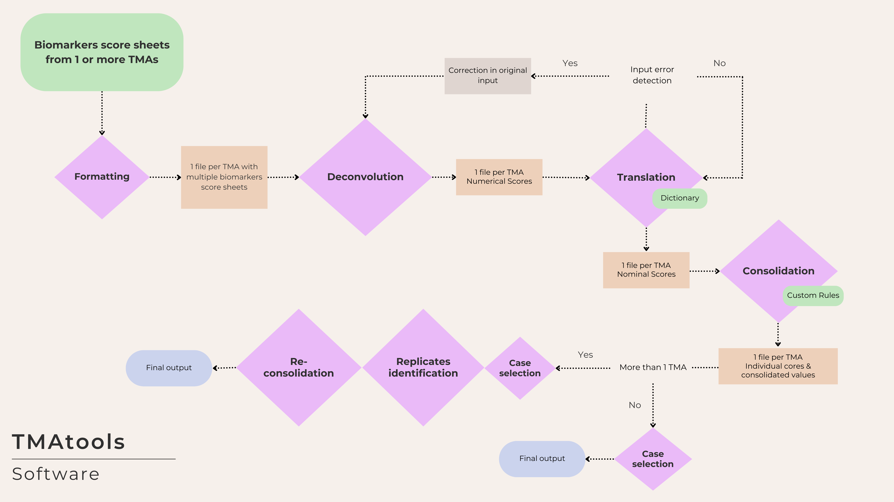

# TMAtools

The goal of TMAtools is to facilitate the efficient and reproducible
processing and integration of TMA data at scale.

Documentation and examples are available at
[edgeresearch-ca.github.io/TMAtools](https://edgeresearch-ca.github.io/TMAtools/).

## Overview



TMAtools overview fig.

## Installation

You can install the development version of TMAtools from
[GitHub](https://github.com/EDGEResearch-CA/TMAtools) with:

``` r
# install.packages("remotes")
remotes::install_github("EDGEResearch-CA/TMAtools")
```

## Example

This is a basic example which shows you how to solve a common problem:

``` r
library(TMAtools)
# 2 directories with TMA files
tma_dirs <- c(
 system.file("extdata", "tma1", package = "TMAtools"),
 system.file("extdata", "tma2", package = "TMAtools")
)
# spreadsheet with translation and consolidation rules
# for the examples tma1 and tma2
biomarker_rules_file <- system.file(
  "extdata", "biomarker_rules_example.xlsx",
  package = "TMAtools"
)

# Run the TMAtools pipeline
tmatools(
  tma_dirs = tma_dirs,
  biomarker_rules_file = biomarker_rules_file,
  output_dir = "tmatools_output"
)
```

## Processing your own data

To process your own data, `TMAtools` requires two main inputs: a
**biomarker rules file** and one or more **TMA folders**, as explained
below.

### Biomarkers rule file

Excel file containing translation and consolidation rules. It must be
placed outside TMA folders. Column names should match the template file
[`inst/extdata/biomarker_rules_example.xlsx`](https://github.com/EDGEResearch-CA/TMAtools/blob/master/inst/extdata/biomarker_rules_example.xlsx)
(download the raw file from GitHub to explore in Excel). You can create
a copy of this file for your own customization with the code below.

``` r
example_rules <- system.file(
  "extdata", "biomarker_rules_example.xlsx",
  package = "TMAtools"
)
file.copy(example_rules, "biomarker_rules_example_copy.xlsx")
```

#### Full template for IHC biomarkers and customization

TMAtools also includes another rules template file called
[`inst/extdata/biomarker_rules_enoc.xlsx`](https://github.com/EDGEResearch-CA/TMAtools/blob/master/inst/extdata/biomarker_rules_enoc.xlsx),
which contains translation and consolidation rules for 19 different
biomarkers applied to studying Endometrioid and Clear Cell Ovarian
Carcinomas. You can create a copy of this file for your own
customization with the code below.

``` r
enoc_rules <- system.file(
  "extdata", "biomarker_rules_enoc.xlsx",
  package = "TMAtools"
)
file.copy(enoc_rules, "biomarker_rules_enoc_copy.xlsx")
```

### TMA folders

There must be one folder per TMA (the folder name will be used as a
label in output files). Each TMA folder should contain the files below.

You can check out the contents of the
[tma1](https://github.com/EDGEResearch-CA/TMAtools/tree/master/inst/extdata/tma1)
and
[tma2](https://github.com/EDGEResearch-CA/TMAtools/tree/master/inst/extdata/tma2)
examples on GitHub.

#### Score sheets

Each score sheet is an Excel file with the actual scores (and
potentially other tabs). There must be one score sheet per biomarker.
The tab that includes the actual scores should be the same in all score
sheets (controlled by the `biomarker_sheet_index` argument of the
[`tmatools()`](https://edgeresearch-ca.github.io/tmatools/reference/tmatools.md)
function). The name of the biomarker is retrieved from the name of this
tab, which should match the name in the rules file. `TMAtools` will let
you know if some of these don’t match.

You can explore an example in the file
[`inst/extdata/tma1/example_er.xlsx`](https://github.com/EDGEResearch-CA/TMAtools/blob/master/inst/extdata/tma1/example_er.xlsx)
on GitHub (download the raw file to inspect in Excel).

#### Clean map

An Excel file containing “clean_map” in the name. This file corresponds
to the sector map of your TMA that only contains the core IDs within the
corresponding cells. No other annotation outside the map is allowed, as
`TMAtools` uses the exact positions of core IDs to map corresponding
scores.

You can explore an example in the file
[`inst/extdata/tma1/tma1_clean_map.xlsx`](https://github.com/EDGEResearch-CA/TMAtools/blob/master/inst/extdata/tma1/tma1_clean_map.xlsx)
on GitHub.

#### Metadata

An Excel file with “metadata” in the name. In a single tab, it must
contain at least two columns: “core_id” (core IDs that appear in the
sector map) and “accession_id” (case or patient identifiers).
Optionally, you can add other columns with additional metadata (e.g.,
age, sex, histotype, block number), which will be carried forward to
your output files.

You can explore an example in the file
[`inst/extdata/tma1/example_metadata.xlsx`](https://github.com/EDGEResearch-CA/TMAtools/blob/master/inst/extdata/tma1/tma1_clean_map.xlsx)
on GitHub.
